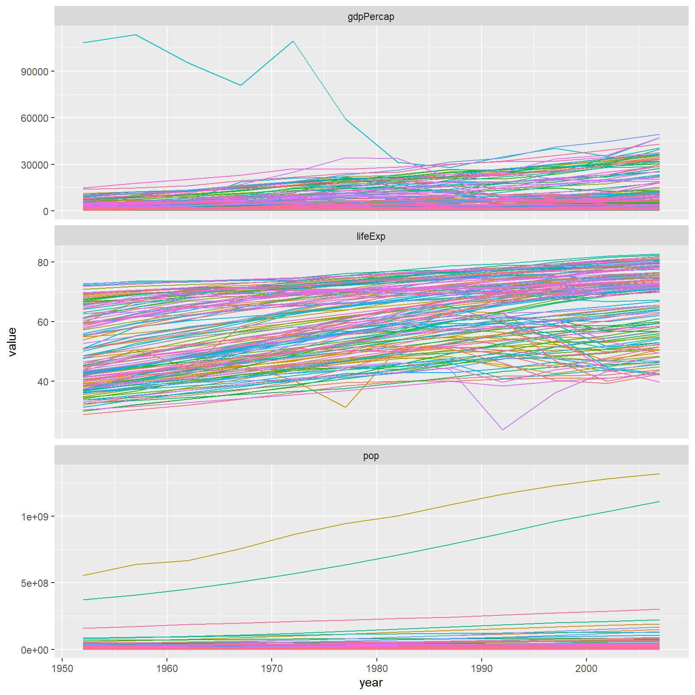

Researchers often want to manipulate their data from the 'wide' to the 'long'
format, or vice-versa. The 'long' format is where:

 - each column is a variable
 - each row is an observation

In the 'long' format, you usually have 1 column for the observed variable and
the other columns are ID variables.


For the 'wide' format each row is often a site/subject/patient and you have
multiple observation variables containing the same type of data. These can be
either repeated observations over time, or observation of multiple variables (or
a mix of both). You may find data input may be simpler or some other
applications may prefer the 'wide' format. However, many of `R`'s functions have
been designed assuming you have 'long' format data. This tutorial will help you
efficiently transform your data regardless of original format.


These data formats mainly affect readability. For humans, the wide format is
often more intuitive since we can often see more of the data on the screen due
to its shape. However, the long format is more machine readable and is closer
to the formatting of databases. The ID variables in our dataframes are similar to
the fields in a database and observed variables are like the database values.

## Getting started

First install the packages if you haven't already done so (you probably
installed dplyr in the previous lesson):


```r
install.packages("tidyr")
install.packages("dplyr")
install.packages("readr")
```

Load the packages


```r
library("tidyr")
library("dplyr")
library("readr")
```

First, lets look at the structure of our original gapminder dataframe:


```r
gapminder <- read_csv("data/gapminder_data.csv")
```

```
Parsed with column specification:
cols(
  country = col_character(),
  year = col_double(),
  pop = col_double(),
  continent = col_character(),
  lifeExp = col_double(),
  gdpPercap = col_double()
)
```

```r
gapminder
```

```
# A tibble: 1,704 x 6
   country      year      pop continent lifeExp gdpPercap
   <chr>       <dbl>    <dbl> <chr>       <dbl>     <dbl>
 1 Afghanistan  1952  8425333 Asia         28.8      779.
 2 Afghanistan  1957  9240934 Asia         30.3      821.
 3 Afghanistan  1962 10267083 Asia         32.0      853.
 4 Afghanistan  1967 11537966 Asia         34.0      836.
 5 Afghanistan  1972 13079460 Asia         36.1      740.
 6 Afghanistan  1977 14880372 Asia         38.4      786.
 7 Afghanistan  1982 12881816 Asia         39.9      978.
 8 Afghanistan  1987 13867957 Asia         40.8      852.
 9 Afghanistan  1992 16317921 Asia         41.7      649.
10 Afghanistan  1997 22227415 Asia         41.8      635.
# ... with 1,694 more rows
```

> ## Challenge 1
>
> Is gapminder a purely long, purely wide, or some intermediate format?
>
>
> > ## Solution to Challenge 1
> >
> > The original gapminder data.frame is in an intermediate format. It is not
> > purely long since it had multiple observation variables
> > (`pop`,`lifeExp`,`gdpPercap`).
> 

Sometimes, as with the gapminder dataset, we have multiple types of observed
data. It is somewhere in between the purely 'long' and 'wide' data formats. We
have 3 "ID variables" (`continent`, `country`, `year`) and 3 "Observation
variables" (`pop`,`lifeExp`,`gdpPercap`). This intermediate format can be
preferred despite not having ALL observations in 1 column given that all 3
observation variables have different units. There are few operations that would
need us to stretch out this dataframe any longer (i.e. 4 ID variables and 1
Observation variable).

While using many of the functions in R, which are often vector based, you
usually do not want to do mathematical operations on values with different
units. For example, using the purely long format, a single mean for all of the
values of population, life expectancy, and GDP would not be meaningful since it
would return the mean of values with 3 incompatible units. The solution is that
we first manipulate the data either by grouping (see the lesson on `dplyr`), or
we change the structure of the dataframe.  **Note:** Some plotting functions in
R actually work better in the wide format data.

## Convert long format with gather()
Here we have used piping syntax which is similar to what we were doing in the
previous lesson with dplyr. In fact, these are compatible and you can use a mix
of tidyr and dplyr functions by piping them together

Inside `gather()` we first name the new column for the new ID variable and then
the value column taking the `country`, `year` and `continent` variables out
of the gathering process:

```r
gapminder_long <- gapminder %>% 
    gather(key = vars, value = value, -country, -year, -continent)
```

Inside `spread()` we have the opposite situation where we take the `vars` column and spread
it over to separate columns with `value` filling those cells:

```r
gapminder_wide <- gapminder_long %>% spread(key = vars, value = value)
```

## Advantage to plotting and tables
Reshaping your data from wide to long provides considerable flexibility for 
presenting your results. Combining some `dplyr` grouping code with tidyr 
we can produce a nice table:

```r
gapminder %>% 
    gather(key = vars, value = value, -country, -year, -continent) %>% 
    group_by(continent, vars) %>% 
    summarise(total_pop = sum(value)) %>% 
    spread(key = continent, value = total_pop)
```

```
# A tibble: 3 x 6
  vars           Africa    Americas         Asia      Europe    Oceania
  <chr>           <dbl>       <dbl>        <dbl>       <dbl>      <dbl>
1 gdpPercap    1368903.    2140833.     3129252.    5209011.    446919.
2 lifeExp        30492.      19398.       23786.      25885.      1784.
3 pop       6187585961  7351438499  30507333902. 6181115304  212992136 
```

Similarly, gathering can provide considerable more flexibility when plotting by grouping 
variables we might want to facet:

```r
library(ggplot2)

ggplot(gapminder_long, aes(x = year, y = value, colour = country)) +
    geom_line() +
    guides(colour = FALSE) +
    facet_wrap(~vars, scales = "free_y", ncol = 1)
```




## Other great resources

* [R for Data Science](http://r4ds.had.co.nz/index.html)
* [Data Wrangling Cheat sheet](https://www.rstudio.com/wp-content/uploads/2015/02/data-wrangling-cheatsheet.pdf)
* [Introduction to tidyr](https://cran.r-project.org/web/packages/tidyr/vignettes/tidy-data.html)
* [Data wrangling with R and RStudio](https://www.rstudio.com/resources/webinars/data-wrangling-with-r-and-rstudio/)
